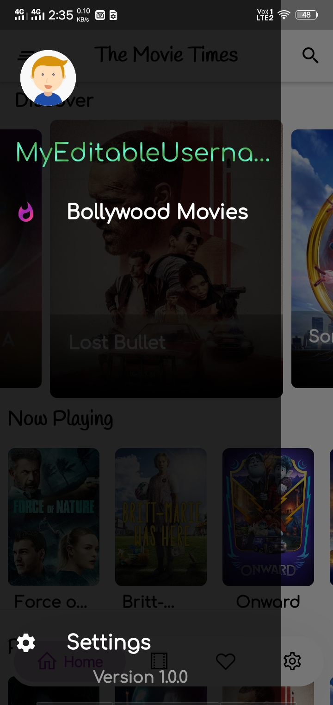
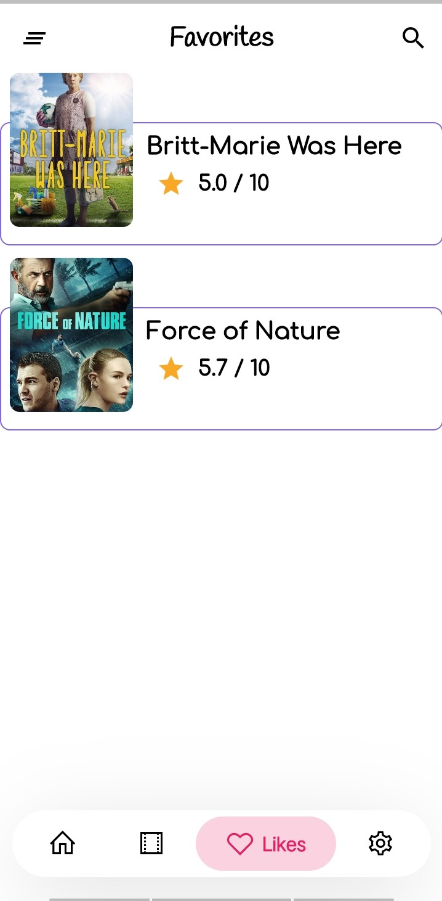
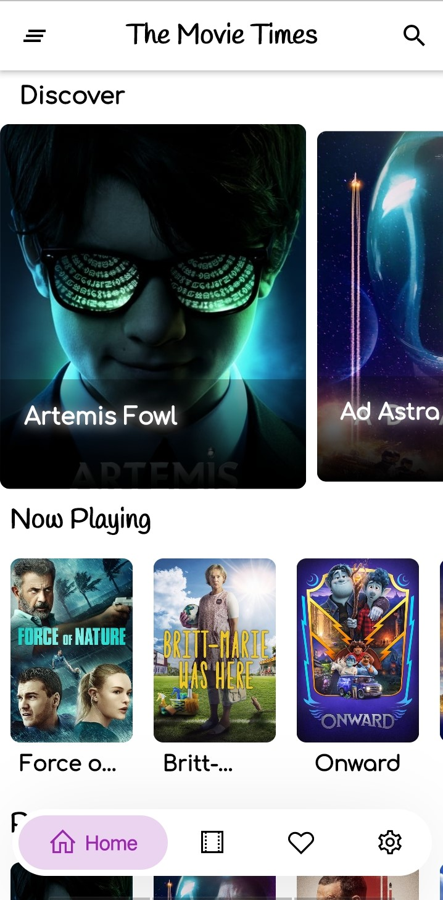
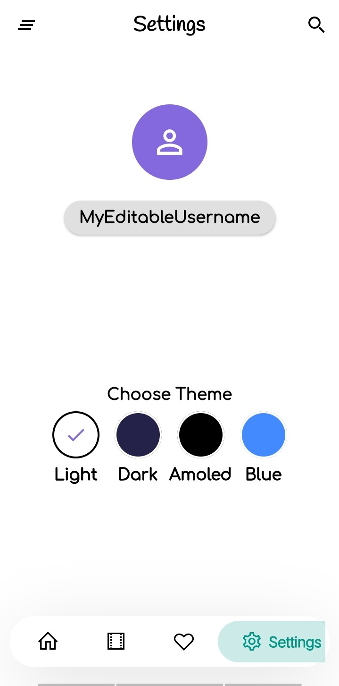

# movie_times

###### A Movie Info App Made Using Flutter. This is an Extended version of https://github.com/bimsina/Matinee-Flutter.git. Thanks to the author
 

 
   
  

  

  
   
    

    
 
   

